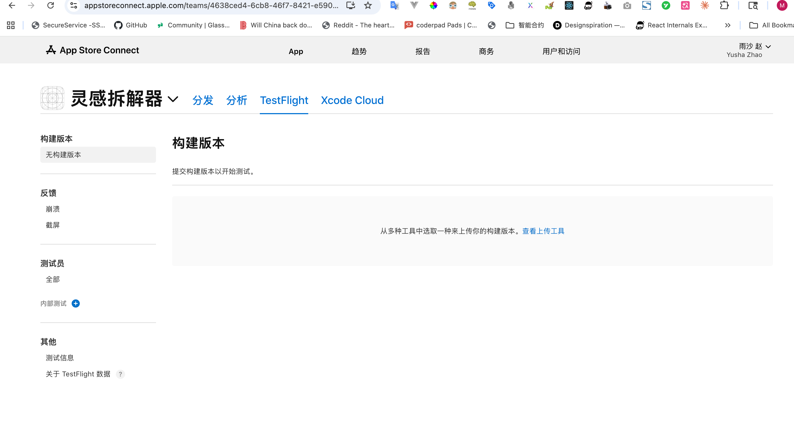

<!-- @format -->

# AI 产品经理 100 道面试题

说明：这份清单是我根据公开资料里的高频题型整理后，按面试常见模块扩展成的 100 题练习版。它不是逐字摘抄网页，而是把重复出现的考点收拢成一份更适合刷题的版本。

## 1. AI 基础理解

1. AI 产品经理和传统产品经理最大的区别是什么？
2. 你会怎么用非技术语言解释机器学习、深度学习、大模型三者关系？
3. 监督学习、无监督学习、强化学习分别更适合什么产品场景？
4. 生成式 AI 和判别式 AI 有什么区别？各适合哪些产品？
5. 你如何向老板解释为什么 AI 输出不是 100% 稳定？
6. token 是什么？它为什么会影响成本、速度和体验？
7. temperature、top_p 这类参数会怎样影响产品表现？
8. 基础模型、微调模型、RAG 系统分别是什么？什么时候该选哪一种？
9. embedding 是什么？在产品里常用来解决什么问题？
10. 为什么说 AI 产品是概率系统，而不是传统的确定性系统？

## 2. RAG 与知识库

11. RAG 和微调应该怎么选？
12. RAG 项目最常见的失败点是什么？
13. 你会怎么提升检索准确率？
14. 你如何判断知识库是否需要重建或重新切分？
15. chunk 切得太大或太小，各会带来什么问题？
16. 召回率、准确率、命中率在知识问答里分别怎么看？
17. 如何处理知识库更新滞后导致的错误回答？
18. 用户问到知识库范围外的问题时，产品应该怎么答？
19. 多数据源接入时，遇到互相冲突的答案怎么办？
20. 企业私域知识接入大模型时，你最担心什么？

## 3. Agent 与自动化

21. 什么是 Agent？它和普通聊天机器人有什么本质区别？
22. Workflow 和 Agent 有什么区别？什么时候该用哪种？
23. 单 Agent 和多 Agent 应该怎么选？
24. 多 Agent 和子 Agent 的区别是什么？
25. 管理者 Agent 加执行者 Agent 的模式适合什么场景？
26. 什么情况下不该硬上多 Agent？
27. Agent 的工具调用失败时，产品要怎么兜底？
28. Agent 的规划、执行、反思链路里，最容易出问题的是哪一段？
29. 你会怎么设计一个可审计的 Agent 执行记录？
30. 一个 Agent 产品的成功指标应该怎么定？

## 4. 评测与指标

31. 你会怎么评估 AI 回答质量？
32. 离线评测和在线评测分别该看什么？
33. 人工评审标准怎么定，才不会每个人打分都不一样？
34. 幻觉怎么定义？又该怎么量化？
35. 如何判断模型升级后是真的变好，而不只是换了一种说法？
36. A/B 测试在 AI 产品里有哪些坑？
37. 延迟、成功率、满意度、成本之间怎么权衡？
38. 用户觉得满意，但答案不准确，这算成功吗？
39. 你会怎么建立一套红线 case 集？
40. AI 功能从灰度到全量，你会重点看哪 5 个核心指标？

## 5. 产品设计题

41. 你会怎么设计一个 AI 写简历功能？
42. 你会怎么设计一个 AI 面试陪练功能？
43. 你会怎么设计一个 AI 会议纪要功能？
44. 你会怎么设计一个 AI 搜索功能？
45. 如果用户不知道怎么提问，你会怎么降低使用门槛？
46. AI 产品里的首屏价值应该如何设计？
47. 什么时候该让 AI 自动完成，什么时候必须让用户确认？
48. 你会怎么设计编辑、撤回、重试、追问这些交互？
49. 多轮对话里如何避免上下文越聊越乱？
50. 你会怎么让 AI 建议看起来“可用”，而不是“像在表演”？

## 6. 商业与策略

51. 为什么这个场景值得用 AI，而不是普通规则引擎？
52. 你如何判断一个 AI 需求是真需求还是伪需求？
53. AI 功能应该免费、限免还是付费，怎么切？
54. 你会怎么估算一个 AI 功能的 ROI？
55. 调第三方模型 API 和自建能力的商业分界线在哪里？
56. 如果模型调用成本突然暴涨，你会先优化什么？
57. B 端 AI 产品和 C 端 AI 产品的设计重点有什么不同？
58. 你会如何给老板解释“准确率提升 2% 为什么值钱”？
59. AI 功能上线后没人用，你第一步先查什么？
60. 你如何判断该做 Copilot、Assistant，还是全自动 Agent？

## 7. 推进与协作

61. 你如何跟算法、工程、设计一起定义一期目标？
62. 面对准确、速度、成本的冲突时，你先保哪一个？为什么？
63. 当算法说模型还不行、业务又催上线时，你怎么决策？
64. 你会如何给 AI 项目排优先级？
65. AI 项目的需求文档和传统产品文档最大的不同是什么？
66. 你会怎么拆分 AI 项目的一期、二期、三期？
67. 标注数据不够时，你会怎么推进项目？
68. 当模型效果波动很大时，你如何管理团队和业务预期？
69. 你如何和法务、安全、客服团队协同推进 AI 功能？
70. AI 能力很强，但工程接入复杂，你怎么判断值不值得做？

## 8. 风险与责任

71. 你如何理解 AI 产品里的偏见、公平性和安全性？
72. 如何降低有害内容输出风险？
73. 未成年人、医疗、金融这类高风险场景，你会加哪些限制？
74. 用户上传简历、合同、病历这类敏感信息时，你最担心什么？
75. 数据隐私和个性化体验冲突时，你怎么取舍？
76. AI 建议可能误导用户时，产品该承担什么责任？
77. 你会怎么设计免责声明，才不是“写了等于没写”？
78. 什么情况下 AI 输出必须人工复核？
79. 模型明显胡说时，前端应该怎么呈现才更负责任？
80. 你会怎么向管理层汇报一次 AI 事故？

## 9. 过往经历与行为题

81. 讲一个你把复杂技术问题翻译成业务决策的例子。
82. 讲一个 AI 项目效果不佳，你如何定位问题的例子。
83. 讲一个你和算法团队意见不一致，最后如何推进的例子。
84. 讲一个你砍掉 AI 需求而不是继续投入的例子。
85. 讲一个你通过数据而不是感觉做 AI 决策的例子。
86. 讲一个你处理模型幻觉投诉的例子。
87. 讲一个你在信息不充分的情况下依然推进项目的例子。
88. 讲一个你在资源很少的情况下验证 AI 机会点的例子。
89. 讲一个你如何平衡用户体验和风控的例子。
90. 如果面试官说“你不够懂技术”，你会怎么回应？

## 10. 趋势与判断

91. 未来 1 到 2 年，你看好哪些 AI 产品形态？
92. RAG、Workflow、Agent 在未来产品架构里的位置会怎么变化？
93. 多模态会先在哪些场景真正跑通？
94. AI 产品经理未来最稀缺的能力是什么？
95. 你怎么看“人人都能做 AI 产品”这句话？
96. 你如何看待开源模型和闭源模型的长期竞争？
97. 当模型能力越来越强，产品护城河会转移到哪里？
98. 你怎么看 AI 从辅助走向代办甚至代决策？
99. 如果让你判断一个 AI 赛道是否值得进，你会看哪几个信号？
100.    你认为 AI 产品经理最容易犯的三个错误是什么？

## 公开来源

- https://www.ideaplan.io/blog/ai-pm-interview-questions
- https://www.joinleland.com/library/a/ai-product-manager-interview
- https://igotanoffer.com/en/advice/ai-product-manager-interview
- https://www.productmanagementexercises.com/interview-questions/artificial-intelligence
- https://www.woshipm.com/ai/6286981.html
- https://openai.com/business/guides-and-resources/a-practical-guide-to-building-ai-agents/
- https://www.anthropic.com/engineering/built-multi-agent-research-system
  
